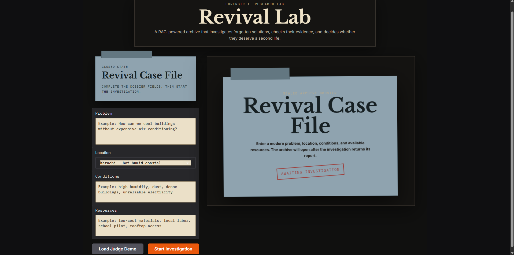
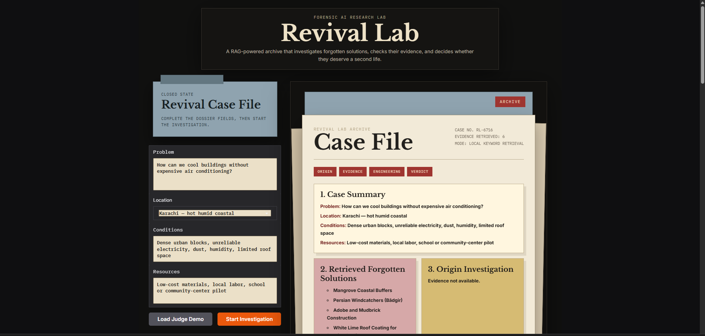
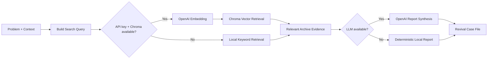

<div align="center">

# 🗂️ Revival Lab

<h2>Forensic RAG for forgotten solutions</h2>

<p>
A research-style AI archive that retrieves overlooked climate and resilience ideas,
examines the evidence behind them, and turns them into modern <strong>revival case files</strong>.
</p>

<p>
  
  
  
  
  
</p>

</div>

---

# ✨ What Revival Lab Does

Revival Lab starts with a **modern problem** — for example, how to cool dense buildings without relying on expensive air conditioning — and searches a curated archive for older or overlooked approaches that may still be useful today.

The interface asks for:

- the problem to investigate
- location / climate context
- real-world constraints
- available resources

It then produces a case-file style investigation built around retrieved archive evidence.

## 🖥️ Interface


## Preview

### Investigation Workspace

<div align="center">



</div>

### Case Analysis Result

<div align="center">



</div>


---

# 🔎 RAG Pipeline



The project has two retrieval paths:

### Semantic RAG mode

When a valid `OPENAI_API_KEY` is available and `chroma_db/` has been built, the application uses:

1. OpenAI embeddings
2. Chroma vector search
3. retrieved evidence chunks
4. LLM-assisted investigation/report generation

### Local fallback mode

If the API key or generated Chroma database is unavailable, the application can fall back to **local keyword/synonym retrieval** over the curated text archive.

This keeps the demo usable without a live vector API, although LLM-generated synthesis is naturally unavailable in that mode and some report sections may be less complete.

---

# 📚 Curated Knowledge Base

The latest project contains **36 curated text documents** covering historical, traditional, low-cost, and nature-based resilience ideas.

Examples include:

- windcatchers
- passive downdraft cooling
- courtyard architecture
- jaali screens
- cool / lime-coated roofs
- rainwater harvesting
- stepwells and qanats
- mangrove buffers
- fog harvesting
- bioswales and rain gardens
- agroforestry
- terrace farming
- traditional drainage systems
- low-cost water storage

The archive is intentionally small and curated so retrieved ideas can be inspected and discussed rather than hidden inside a huge opaque dataset.

---

# 🧠 How Retrieval Works

## Vector Retrieval

`ingest.py` loads every `data/*.txt` document, extracts a title where available, then splits the collection using `RecursiveCharacterTextSplitter`.

Current chunking configuration:

| Setting | Value |
|---|---:|
| Chunk size | `900` characters |
| Chunk overlap | `140` characters |
| Embedding model | `text-embedding-3-small` |
| Vector store | Chroma |
| Persistent directory | `chroma_db/` |

The resulting Chroma database is generated locally and should **not** be committed to GitHub.

## Local Retrieval

The app also contains a keyword-based fallback path. It scores the curated archive using words and related terms from the investigation query, allowing Revival Lab to surface candidate evidence even when the vector pipeline is unavailable.

---

# 🧩 Case-File Experience

The UI is designed like a forensic archive rather than a generic chatbot.

A case can include sections such as:

- **Case Summary** — modern problem, location, constraints and resources
- **Retrieved Forgotten Solutions** — archive ideas surfaced by retrieval
- **Origin Investigation** — where the ideas came from
- **Evidence Review** — what supports or weakens the idea
- **Engineering Plan** — how the idea could be adapted today
- **Verdict** — whether the solution deserves revival

That presentation makes the RAG workflow easier to follow: the user can see both the retrieved ideas and the reasoning built around them.

---

# 🛠️ Tech Stack

| Technology | Role |
|---|---|
| **Python** | Application and retrieval logic |
| **Gradio** | Interactive research interface |
| **LangChain** | Document loading, splitting and RAG components |
| **OpenAI** | Embeddings and LLM-assisted synthesis |
| **Chroma** | Persistent local vector database |
| **python-dotenv** | Environment-variable loading |
| **36 curated `.txt` files** | Searchable research archive |

> `requirements.txt` also contains older project dependencies such as Streamlit and Google Generative AI. They are preserved exactly as supplied; this GitHub package does not modify application dependencies.

---

# 🚀 Getting Started

## 1. Clone the Repository

```bash
git clone <YOUR_REPOSITORY_URL>
cd revival-lab
```

## 2. Create a Virtual Environment

### Windows PowerShell

```powershell
python -m venv .venv
.venv\Scripts\Activate.ps1
```

### macOS / Linux

```bash
python -m venv .venv
source .venv/bin/activate
```

## 3. Install Dependencies

```bash
pip install -r requirements.txt
```

## 4. Configure the API Key

A safe template is included:

```bash
.env.example
```

Copy it to `.env` and replace the placeholder with your own key:

```env
OPENAI_API_KEY=your_api_key_here
```

Never commit the real `.env` file.

## 5. Build the Vector Database

With a valid OpenAI key:

```bash
python ingest.py --reset
```

This generates:

```text
chroma_db/
```

which is ignored by Git because it can be rebuilt from `data/`.

## 6. Run Revival Lab

The current application entry point is:

```bash
python app.py
```

Gradio will print the local URL in your terminal.

> **Important:** the original `ingest.py` still prints an older `streamlit run app.py` message after ingestion. The application itself is currently implemented with Gradio. This GitHub package intentionally leaves the source code unchanged.

---

# 📁 Project Structure

```text
revival-lab/
├── app.py                  # Gradio UI, retrieval and report generation
├── ingest.py               # Chroma ingestion / embedding pipeline
├── requirements.txt        # Original Python dependencies
├── README_RAG_STEPS.md     # Original project setup notes
├── .env.example            # Safe environment template added for GitHub
├── .gitignore              # Excludes secrets and generated/local files
├── data/                   # 36 curated evidence documents
└── docs/
    ├── ARCHITECTURE.md
    ├── RAG_PIPELINE.md
    ├── FALLBACK_MODE.md
    └── images/
        ├── case-input.png
        └── case-report.png
```

Not included in the public package:

```text
.venv/
__pycache__/
chroma_db/
.env
```

These are environment-specific, generated, or secret-bearing files and should be recreated locally.

---

# 📖 What This Project Demonstrates

## RAG fundamentals

- document ingestion
- chunking and overlap
- embedding generation
- semantic retrieval
- context-grounded generation
- persistent vector storage

## Retrieval resilience

- semantic vector search when the API and vector store are available
- local keyword fallback when they are not
- visible evidence retrieval instead of relying only on generated prose

## AI product design

- turning a RAG pipeline into a clear user workflow
- designing around evidence and traceability
- separating retrieved sources from generated interpretation
- making degraded/fallback operation part of the experience

## Research-oriented UX

The “case file” metaphor turns a technical retrieval pipeline into a product that feels like an investigation rather than a chatbot wrapper.

---

# 🔍 Technical Documentation

- [Architecture](docs/ARCHITECTURE.md)
- [RAG Pipeline](docs/RAG_PIPELINE.md)
- [Fallback Mode](docs/FALLBACK_MODE.md)

---

<div align="center">

## Old ideas. New evidence. Future solutions.

**Revival Lab asks a simple question: which forgotten solutions deserve a second life?**

</div>
