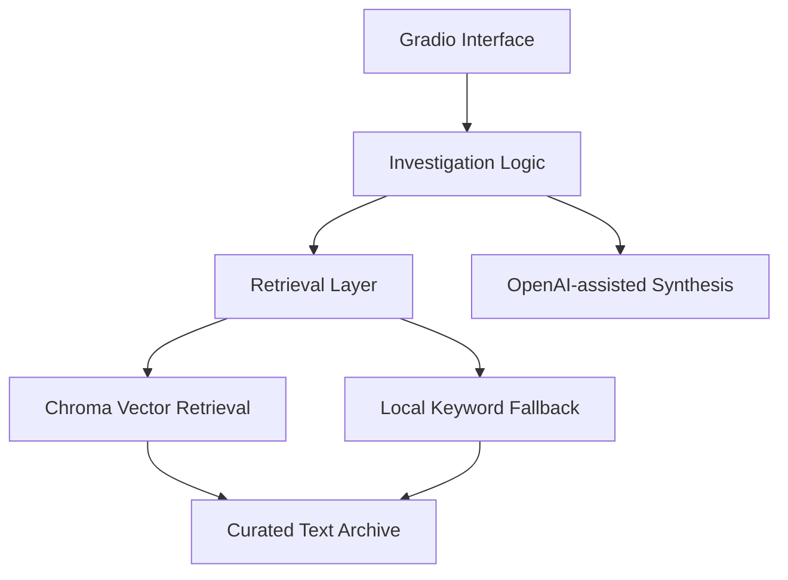

# 🏗️ Revival Lab Architecture

## Overview

Revival Lab is a small RAG research application with three main layers:

## Interface Layer

`app.py` owns the Gradio interface and the visual case-file experience.

The user supplies:

- problem
- location
- conditions
- available resources

The same module also coordinates retrieval and report rendering.

## Knowledge Layer

The `data/` folder is the canonical archive. It contains 36 human-readable text documents.

The generated `chroma_db/` folder is only an index over that archive and can be rebuilt at any time.

## Vector Layer

`ingest.py`:

1. loads `data/*.txt`
2. adds title/source metadata
3. splits documents into overlapping chunks
4. generates OpenAI embeddings
5. persists chunks into Chroma

## Fallback Layer

When vector retrieval is not available, the application can use local keyword/synonym scoring over the archive.

This reduces dependency on an online model provider for basic demonstrations, although the quality and completeness of the generated investigation can differ from full RAG mode.

## Repository Hygiene

For GitHub, the source archive is committed while machine-specific/generated artifacts are ignored:

- `.venv/`
- `__pycache__/`
- `chroma_db/`
- `.env`
